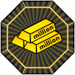
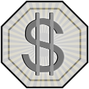
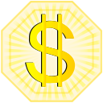
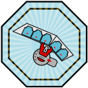

# Mise à jour 1.10.0
↪ *le 30 Janvier 2021*

**Mise à jour spéciale 1 an !**

---

⇰ La base de donnée des cartes a été mise à jour. 1 158 cartes ont été introduites. (Nouvelles cartes et/ou en différentes raretés)

# NOUVEAUTÉS

⇰ **Commandes**

 • Préfixes sur les raretés et booster.
   *Pour plus d'informations faites la commande* `booster` ou `rarities`.

⇰ **Filtres**

• Le filtre `count` a été ajouté sur la commande `wikilist` pour récupérer toutes les cartes que vous ne possédez pas.
  *Exemple :* `wikilist count=0`

• Les filtres marker et link ont été ajoutés pour les commandes `inventory` & `wikilist`.
  *Exemple :* `inventory link=5 marker="bottom,top"` [Ceci vous permettra de récupérer toutes les cartes lien qui ont une valeur de lien de 5 et qui ont des marqueur bas et haut.]

• Le filtre `scale` a été ajouté pour les commandes `inventory` & `wikilist`.
  *Exemple :* `inventory scale=>5` [Ceci vous permettra de récupérer toutes les cartes pendules qui ont leur échelle plus grande que 5]

⇰ **Achievements**

• Tous les achievements s'actualise désormais automatiquement.

• Des nouveaux achievements sont apparus.

⇰ **Usine**

• Le type de rareté des cartes monstres influe désormais sur le gain d'énergie de votre usine.

• Les cartes de type `Token` permettent désormais d'augmenter votre capacité de stockage. +20 par carte placé. Vous perdrez une carte par jour et vous pouvez en placer 10 maximums.

• Les cartes de type `Pendule` permettent d'augmenter 2000 fois la valeur de leur échelle, l'énergie maximum de l'usine. Vous perdrez 10% de vos points d'énergies bonus investis par jour et vous pouvez mettre 5 cartes pendule maximum et/ou votre niveau d'usine multiplié par 5000.

• L'auto-fill a été implémenter pour remplir automatiquement votre usine avec les cartes manquantes. 
  **ATTENTION** L'auto-fill ne fonctionne que sur les cartes dont vous avez en plusieurs exemplaires. Elle fait également aucune distinction entre les cartes rares. Si vous souhaitez sécuriser vos cartes pensez à les bloquer avec le `lock`.
  *Exemple :* `factory autofill`

• La possibilité de bloquer ou débloquer n'importe quel carte avec les arguments `lock` et `unlock` afin de la prendre ou non en compte dans l'auto-fill de l'usine.
  *Exemple :* `factory lock card_id.rarity ...` | `factory unlock card_id.rarity ...`

⇰ **Badges**

• Des badges sont disponibles aux joueurs qui accomplissent certaines conditions !

```yml
Millionaire: Avoir l'achievement du million.
Jackpot: Obtenir le jackpot à la RollMachine.
Staff: Faire partie de notre équipe.
Traducteur: Corriger les fautes ou faites de la traduction pour de nouvelles langues.
Collectionneur: Avoir toutes les cartes.
Donateur: Faire une donations (Niveau 1: <= 10€, Niveau 2: <= 50€, Niveau 3: > 50€)
Voteur: Voter 60 fois dans le courant du mois.
Support: Etre sur le serveur support.
Classement: Etre dans le top 3 des joueurs.
Joueur d'élite: Atteindre le niveau 200.
```










⇰ **Votes**

• Récupérer une quête en votant sur top.gg: **[[voter]](https://top.gg/bot/672416519912947732/vote)**

⇰ **Profil**

• Votre classement apparait maintenant sur votre profil.

• Les badges obtenus apparaissent sur le profil.

---

# CORRECTIONS

⇰ **Alarme**

• Le temps sur l'alarme des `secretword` a été corrigé. La notification s'enverra désormais dès que le bureau sera ouvert.

⇰ **Filtres**

• Le filtre des raretés a été modifié afin de pouvoir en stipuler plusieurs.
  *Exemple :* `inventory rarity="common,super rare"` [Ceci vous permettra de récupérer toutes vos cartes avec les raretés `common` & `super rare`.]
  *Il est bien sûr possible de faire de même avec la commande `wikilist` ainsi que d'ajouter `!` au début pour récupérer tous ce qui n'est pas `common` et `super rare`*

⇰ **Options**

• L'option pour changer l'emplacement des images sur les informations d'une carte s'applique aussi sur votre profil et sur la récompense du **YGiPass**.
  *Exemple :* `settings image big` [Ceci mettra toutes vos images en grande.]

⇰ **Icons**

• L'icon pour l'échelle de pendule a été corrigé sur les informations des cartes pendules.

⇰ **Quêtes**

• Les informations de la quête s'affiche désormais lorsque vous la gagnez à la **RoleMachine**.

• Le nombre de quêtes restantes apparaissent désormais sur la commande `quests`.

⇰ **Usine**

• Les informations adéquates à la carte que vous utilisez pour recharger votre usine apparaissent désormais.

• Les informations du nombre de cartes manquantes apparaissent désormais sur l'affichage de votre usine.
